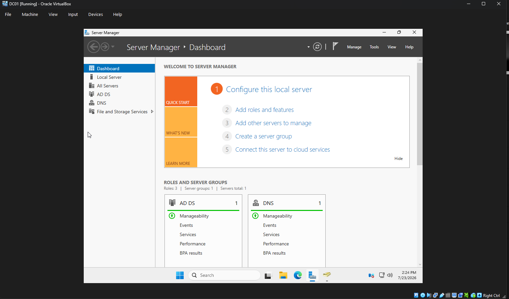
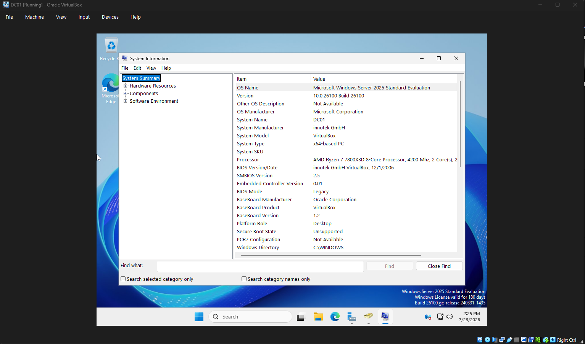
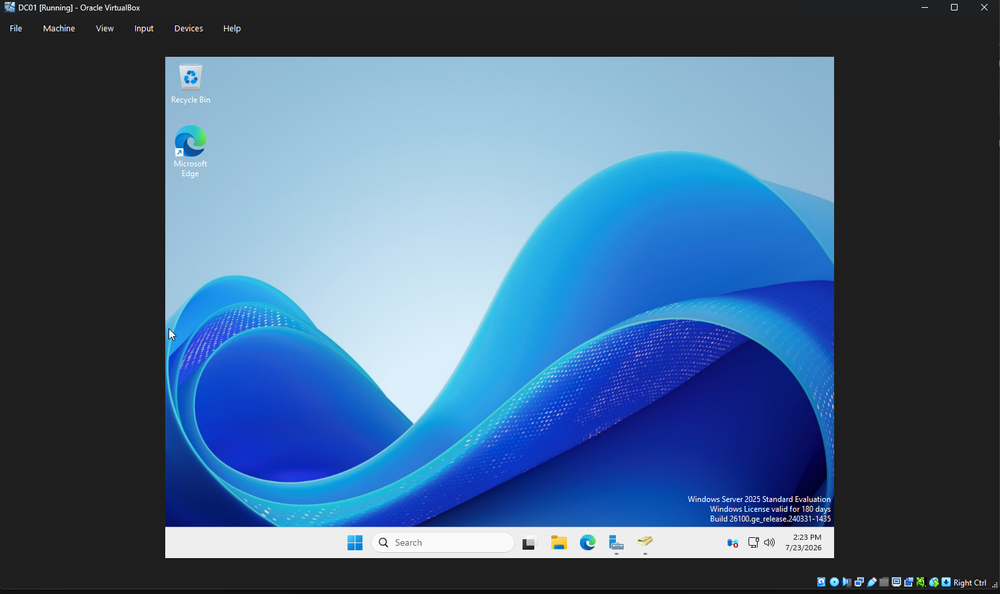

# Chapter 2 - Windows Server Installation

## Objective

Install and configure Windows Server 2025 to prepare it for Active Directory deployment.

## Tasks Completed

- Installed Windows Server 2025 Standard (Desktop Experience)
- Renamed the server to DC01
- Verified Windows installation
- Opened Server Manager

## Screenshots

### Server Manager

### Server Name

### Windows Version

## Skills Demonstrated

- Windows Server installation
- Initial server configuration
- Computer naming
- Server administration
