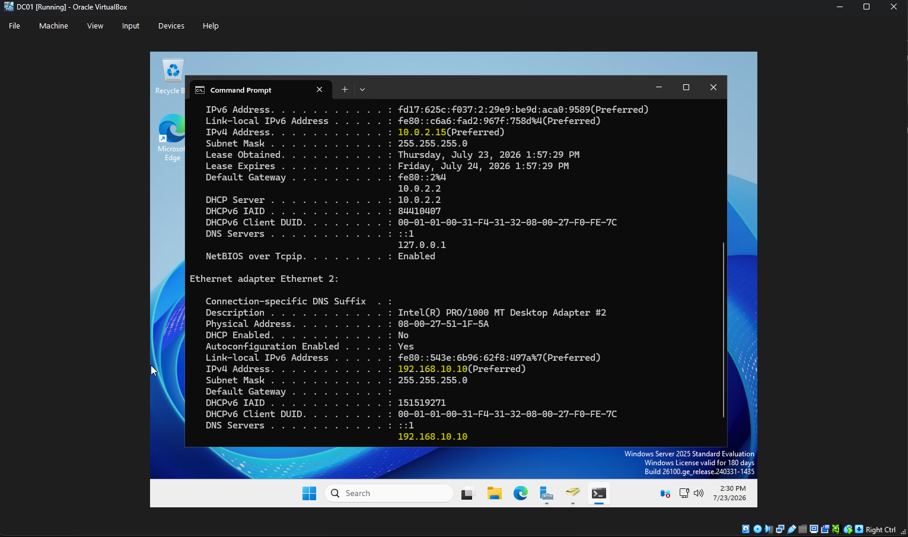
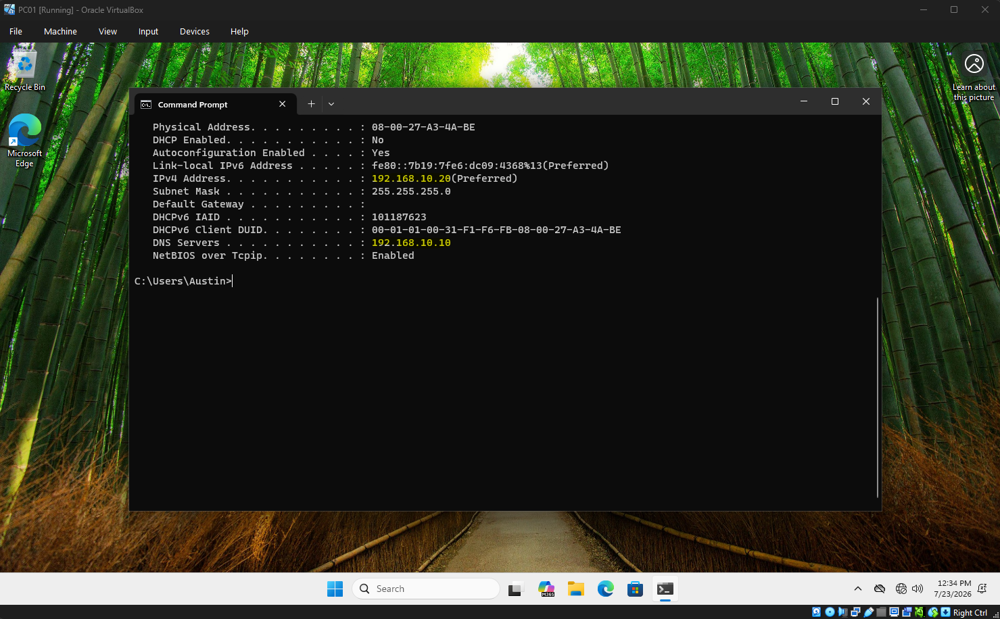
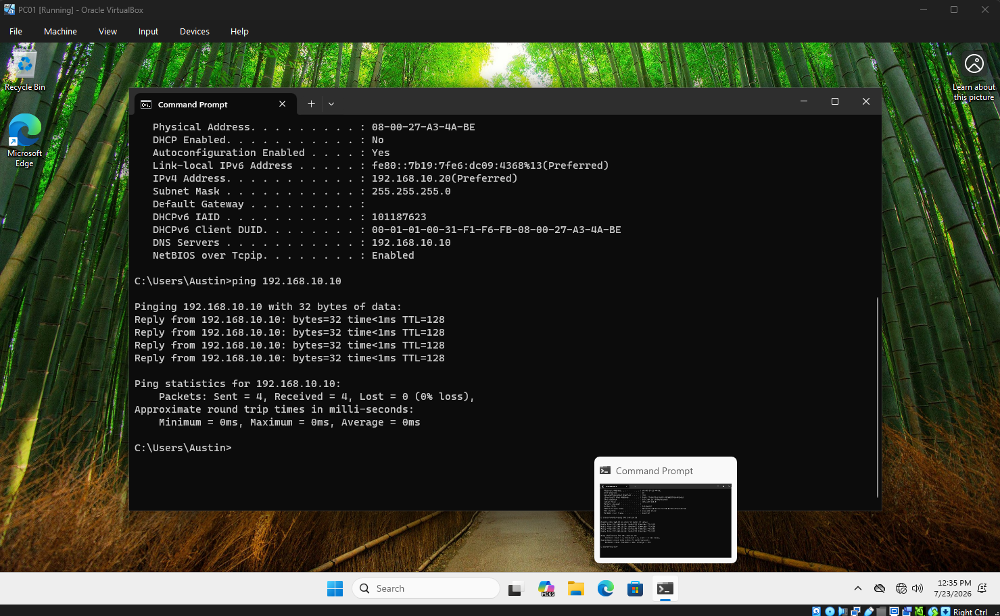
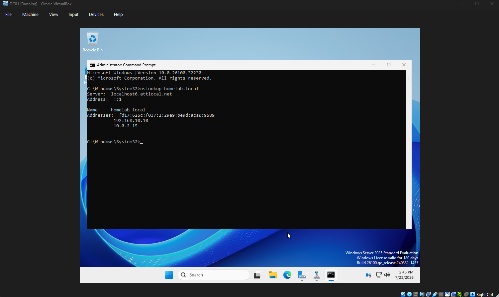

# Chapter 3 - Network Configuration

## Objective

Configure networking for the Domain Controller and client computer.

## Network Design

### DC01

Internal Network

IP Address:
192.168.10.10

Subnet Mask:
255.255.255.0

DNS Server:
192.168.10.10

### PC01

IP Address:
192.168.10.20

Subnet Mask:
255.255.255.0

DNS Server:
192.168.10.10

## Verification

Verified:

- IP configuration
- Connectivity using ping
- DNS functionality
- Communication between virtual machines

## Screenshots

### DC01 IP Configuration

### PC01 IP Configuration

### Successful Ping

### DNS Lookup

## Skills Demonstrated

- TCP/IP configuration
- Static IP addressing
- DNS configuration
- Connectivity troubleshooting
