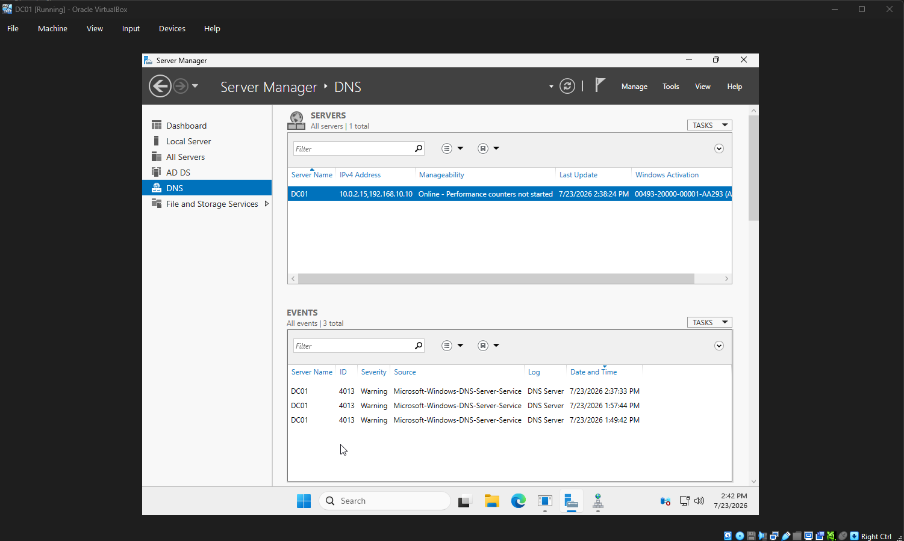
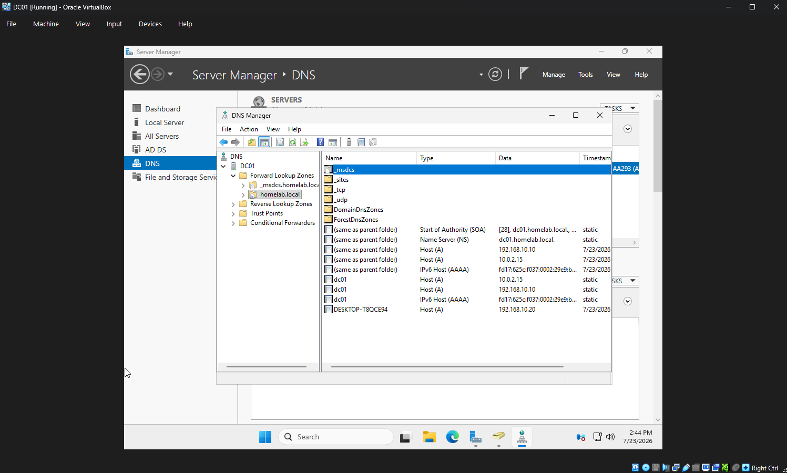

# Chapter 4 - Active Directory Domain Services

## Objective

Deploy Active Directory Domain Services and DNS to create a Windows domain.

## Tasks Completed

- Installed Active Directory Domain Services
- Installed DNS Server
- Promoted the server to a Domain Controller
- Created the homelab.local forest
- Verified DNS functionality

## Domain Information

Domain Name

homelab.local

Server Name

DC01

## Screenshots

### Active Directory

### DNS Manager

### DNS Forward Lookup Zones

## Skills Demonstrated

- Active Directory installation
- DNS deployment
- Domain creation
- Active Directory administration
