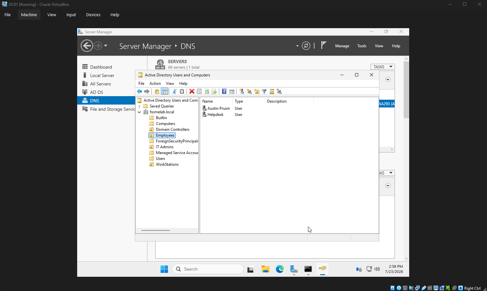
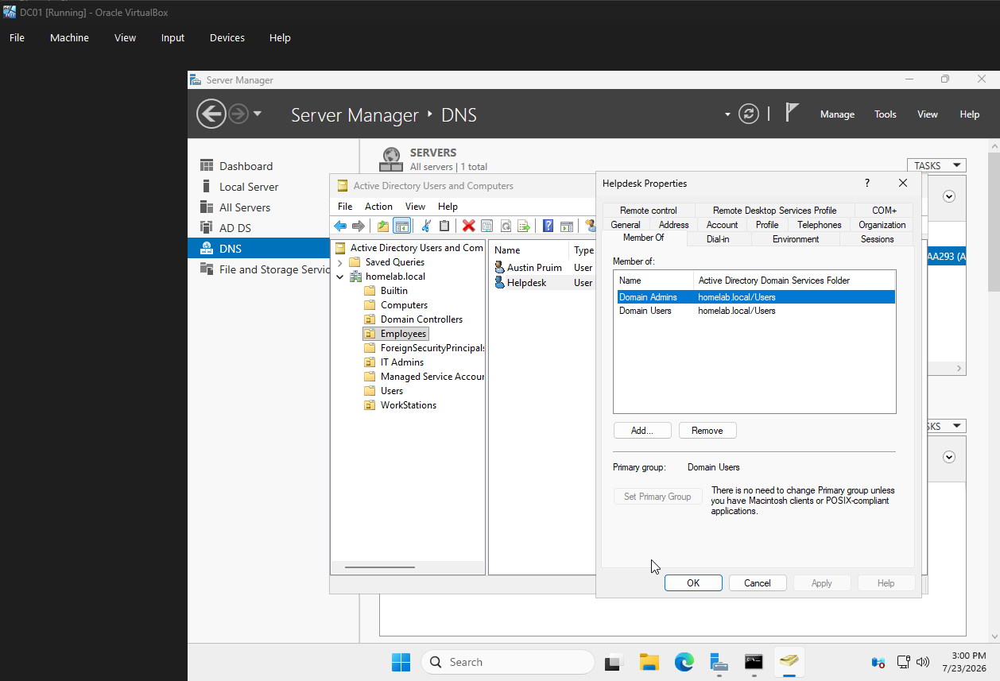

# Chapter 5 - User and Group Management

## Objective

Create users, organizational units, and security groups to simulate a business environment.

## Organizational Units

- Employees
- IT Admins
- Computers
- Workstations
- Servers

## User Accounts

- Austin
- HelpDesk

## Security Groups

- Employees
- IT Support
- Managers

## Tasks Completed

- Created Organizational Units
- Created user accounts
- Created security groups
- Assigned users to groups

## Screenshots

### Organizational Units

### User Accounts

### Security Groups

### Group Membership

## Skills Demonstrated

- Active Directory administration
- User management
- Security groups
- Organizational Units
