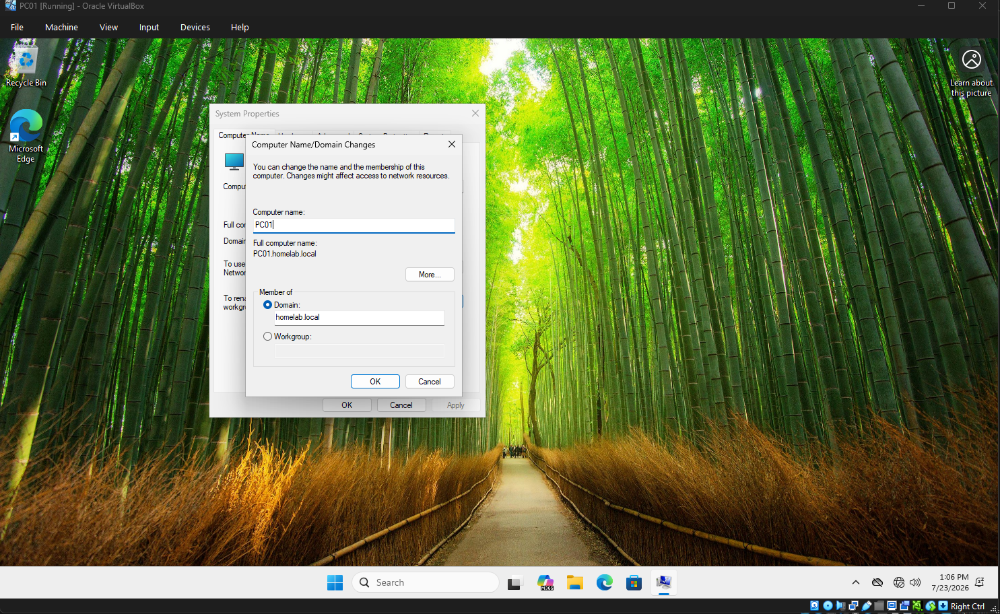
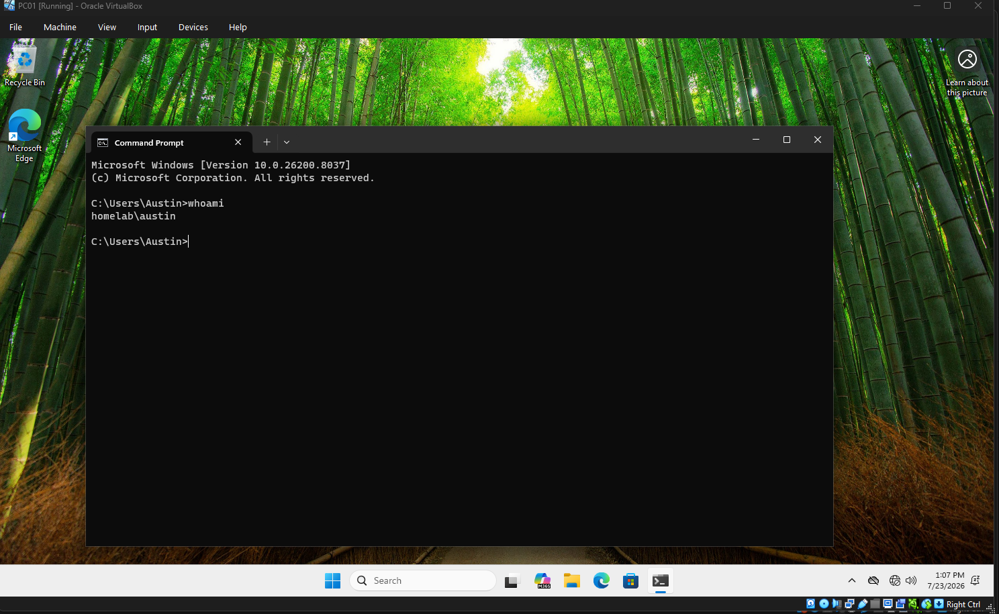

# Chapter 6 - Domain Join

## Objective

Join a Windows 11 Pro client to the Active Directory domain.

## Tasks Completed

- Configured DNS
- Joined PC01 to the domain
- Restarted the workstation
- Logged in with a domain account

## Validation

Verified:

- Domain membership
- Domain login
- Logon server
- User authentication

## Screenshots

### Join Domain

### whoami

### Logon Server

## Skills Demonstrated

- Domain joining
- Windows authentication
- Active Directory login
- Client deployment
