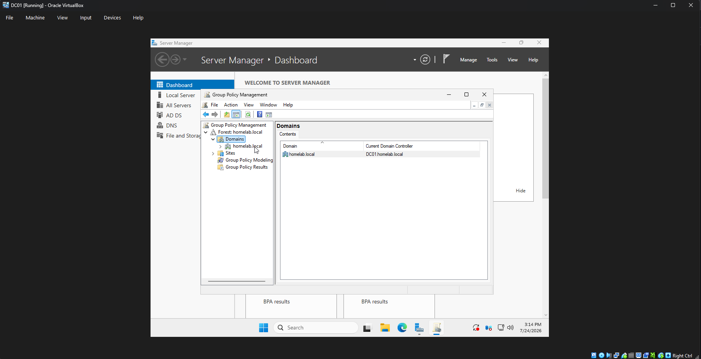
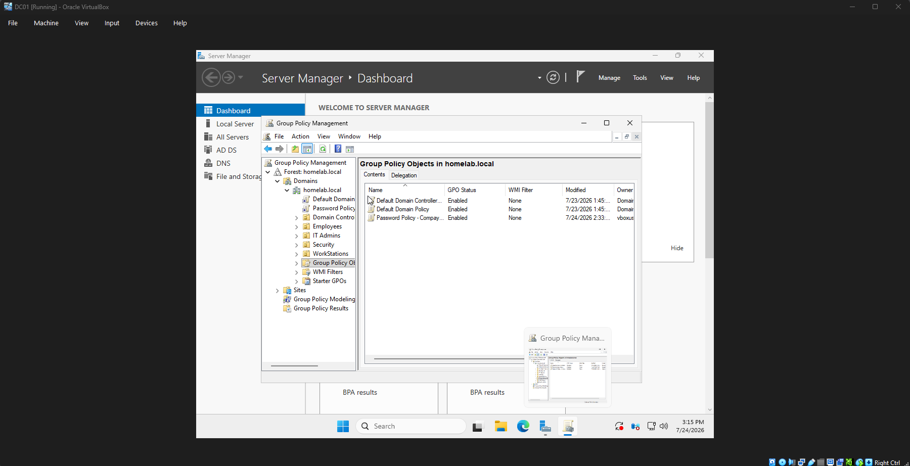
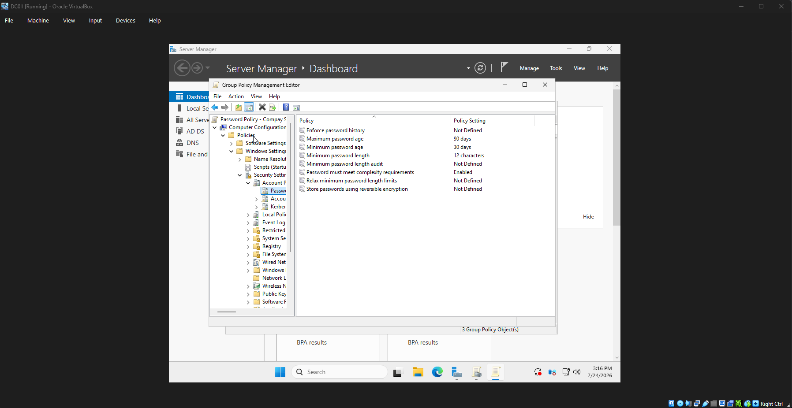
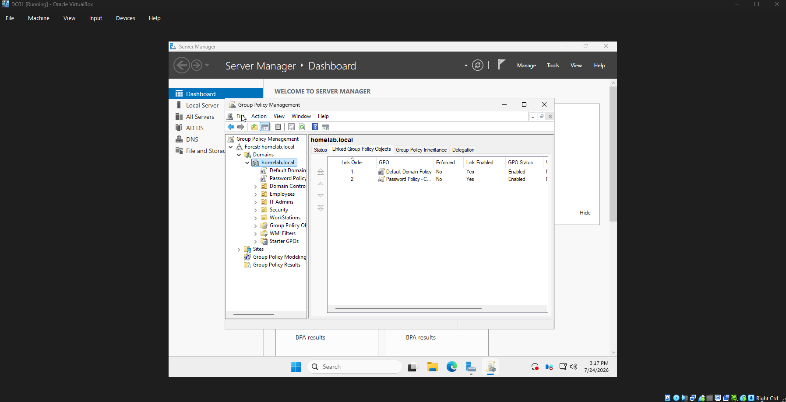
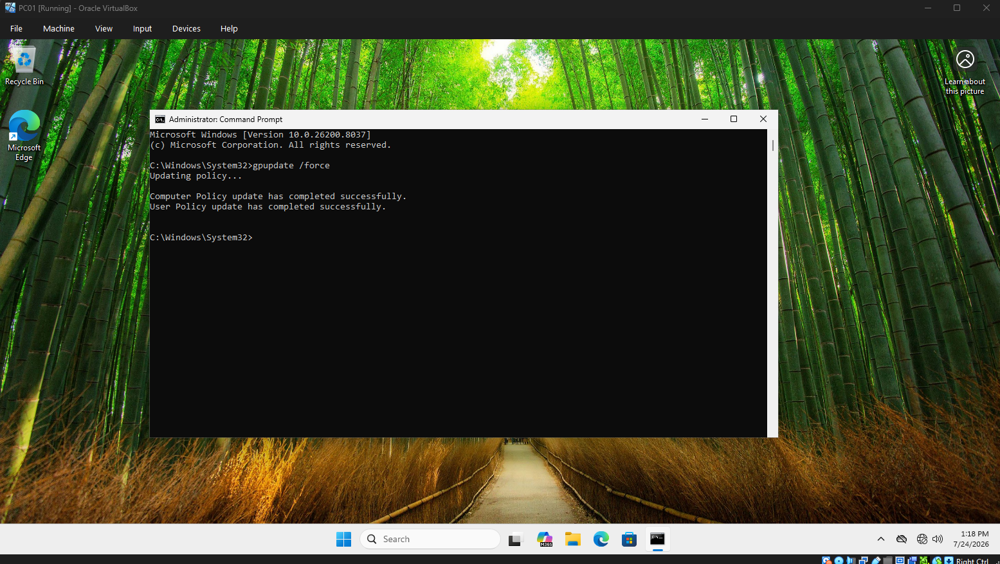
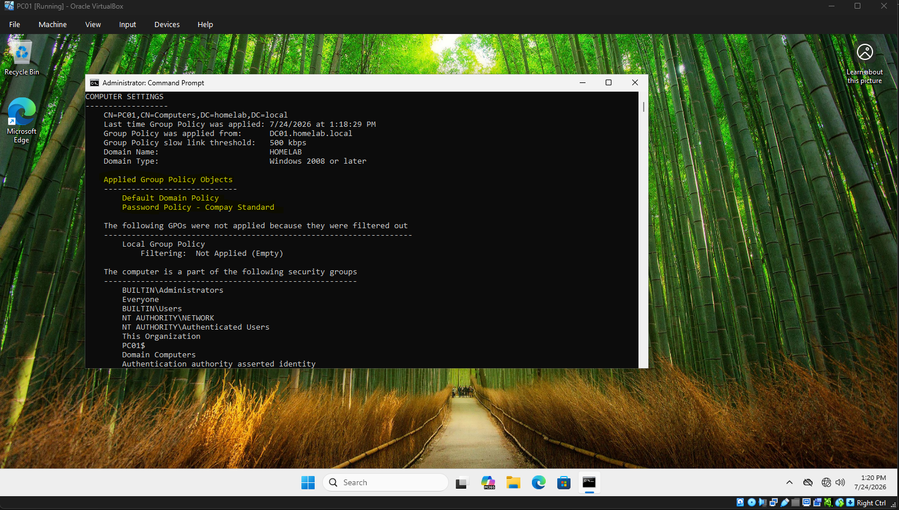

# Chapter 9 - Group Policy Management

## Overview

In this section, I configured and deployed Group Policy Objects (GPOs) within my Windows Server Active Directory environment.

The goal of this chapter was to practice centralized management of Windows security settings across domain-joined computers using Group Policy.

## Lab Environment

| System | Role |
|---|---|
| DC01 | Windows Server 2025 Domain Controller |
| PC01 | Windows 11 Pro Domain-Joined Workstation |
| Domain | homelab.local |

---

# Skills Demonstrated

- Creating and managing Group Policy Objects (GPOs)
- Linking GPOs to an Active Directory domain
- Configuring Windows security policies
- Applying policies to domain computers
- Troubleshooting Group Policy processing
- Using gpupdate and gpresult to verify policy deployment

---

# Creating the Group Policy Object

A new Group Policy Object was created to manage security settings across the homelab domain.

Created GPO:

```
Password Policy - Company Standard
```

The GPO was created inside Active Directory Group Policy Management.



---

# Group Policy Object Created

The custom GPO was successfully created and is visible under:

```
Group Policy Objects
```

This allows centralized management of Windows settings for domain computers.



---

# Configuring Password Policy Settings

The GPO was configured with security settings located under:

```
Computer Configuration
 └── Policies
      └── Windows Settings
           └── Security Settings
                └── Account Policies
                     └── Password Policy
```

Configured settings included:

- Password complexity requirements
- Minimum password length requirements
- Domain security settings



---

# Linking the GPO to the Domain

The Group Policy Object was linked to the homelab.local domain so that domain-joined computers could receive the policy.

Linked location:

```
homelab.local
 └── Linked Group Policy Objects
      └── Password Policy - Company Standard
```



---

# Applying Group Policy Updates

After configuring the policy, the workstation was forced to check for updated policies.

Command used:

```
gpupdate /force
```

The policy update completed successfully on PC01.



---

# Verifying Group Policy Application

The applied policies were verified on PC01 using:

```
gpresult /scope computer /r
```

The output confirmed that the Group Policy Object was successfully applied to the workstation.



---

# Troubleshooting Notes

During testing, I learned the difference between User Configuration and Computer Configuration policies.

The password policy was configured under:

```
Computer Configuration
```

Therefore it appears under:

```
gpresult /scope computer /r
```

rather than the user policy section.

I also investigated domain password policy behavior and learned that default domain password policies are managed differently than standard GPO settings.

