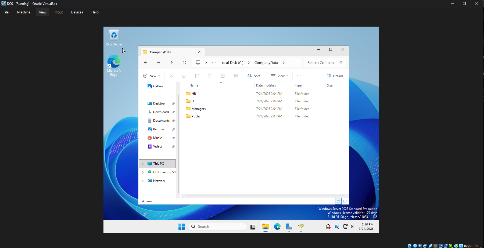
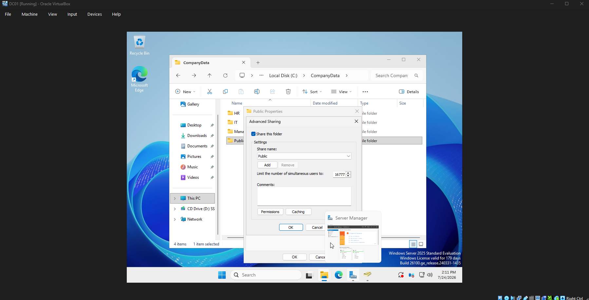
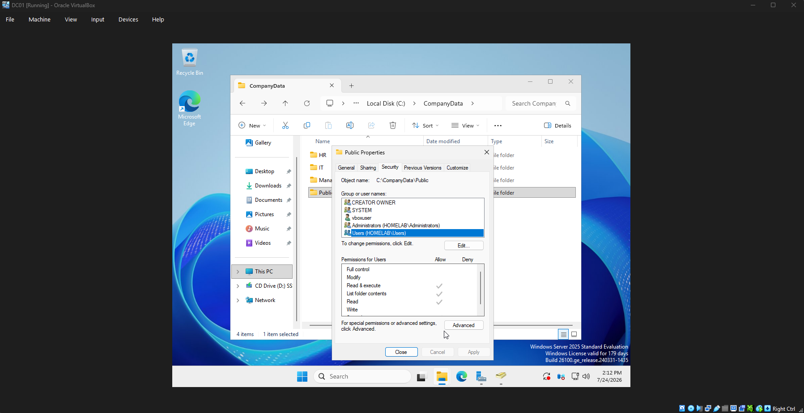
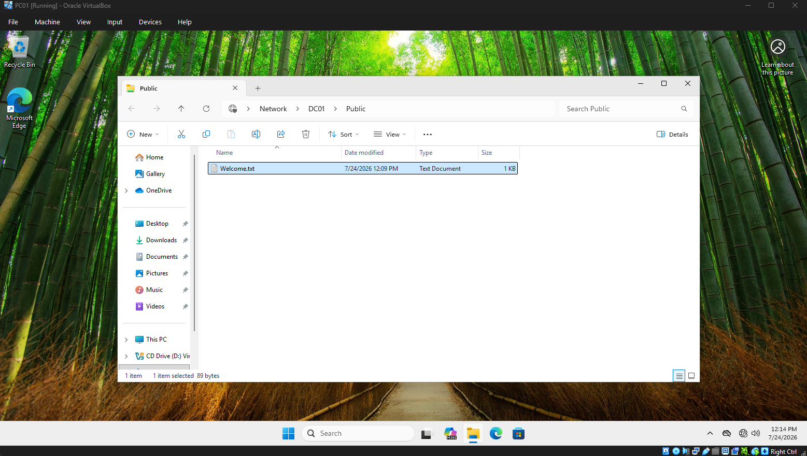
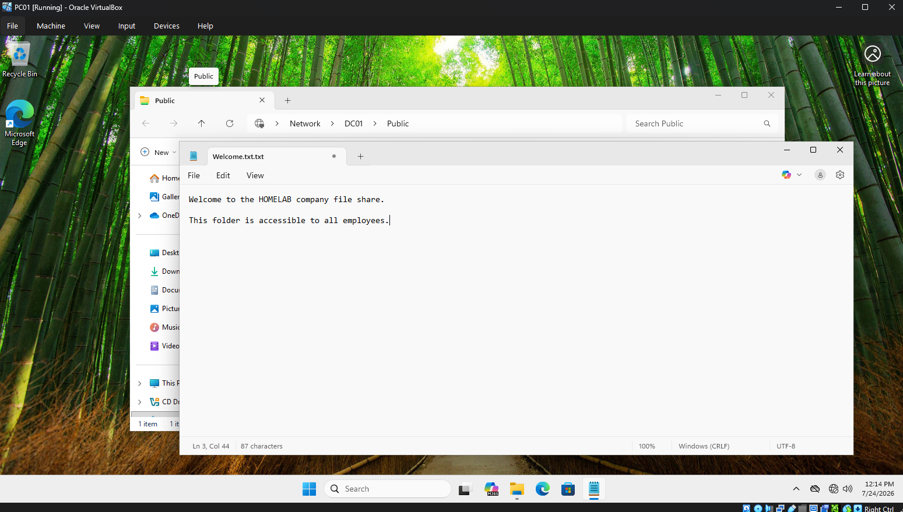

# Chapter 8 - File Server and Permissions

## Objective

Configure a Windows Server file share and manage access to shared resources in a simulated business environment.

This chapter demonstrates how an IT administrator can create shared folders, configure permissions, and verify user access from a domain-joined workstation.

---

# Environment

## Server

**DC01**

- Windows Server 2025
- Active Directory Domain Services
- DNS Server
- File Sharing Services

## Client

**PC01**

- Windows 11 Pro
- Joined to the homelab.local domain

---

# Tasks Completed

- Created a company file structure
- Configured Windows file sharing
- Created an SMB network share
- Configured share permissions
- Verified access from a domain-joined workstation
- Tested file access using a UNC path

---

# File Structure

The following folder structure was created on DC01:

```
C:\CompanyData

├── Public
├── HR
├── IT
└── Managers
```

The folder structure simulates a company environment where different departments can have separate file locations.

---

# Screenshots

## 1. Company File Structure

The screenshot below shows the folder structure created on the Windows Server.

This represents how an organization may separate shared resources by department.



---

## 2. Configuring the Network Share

The Public folder was configured as a shared folder using Windows Advanced Sharing.

Configuration:

- Share Name: Public
- Network Path: \\DC01\Public



---


## 4. NTFS Security Permissions

The Security tab was reviewed to verify NTFS permissions applied to the folder.

NTFS permissions control access at the file system level and work together with share permissions.



---

## 5. Accessing the Share from PC01

The shared folder was accessed from the Windows 11 domain-joined workstation using the UNC path:

```
\\DC01\Public
```

This verifies:

- Network connectivity
- DNS resolution
- Domain authentication
- File share availability



---

## 6. Testing File Access

A test file was created inside the Public share to verify users could access shared resources.

Test file:

```
Welcome.txt
```



---

# Troubleshooting

## Issue

PC01 was unable to access the network share.

## Troubleshooting Steps

- Verified PC01 could communicate with DC01 using ping
- Confirmed DNS was pointing to DC01
- Verified the share was enabled
- Checked permissions on the shared folder

## Resolution

Corrected network and permission settings, allowing PC01 to successfully access the file share.

---

# Skills Demonstrated

- Windows Server file sharing
- SMB protocol
- UNC paths
- Share permissions
- NTFS permissions
- Active Directory resource management
- Client/server troubleshooting

---

# Resume Skills

This project demonstrates experience with:

- Managing Windows Server resources
- Supporting domain users
- Troubleshooting access issues
- Configuring shared network resources
- Understanding enterprise file permissions
